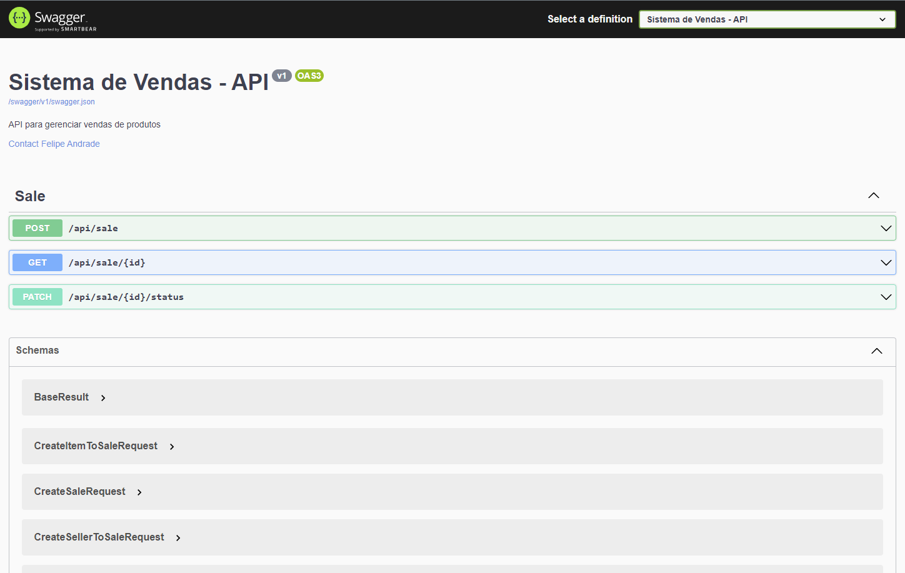
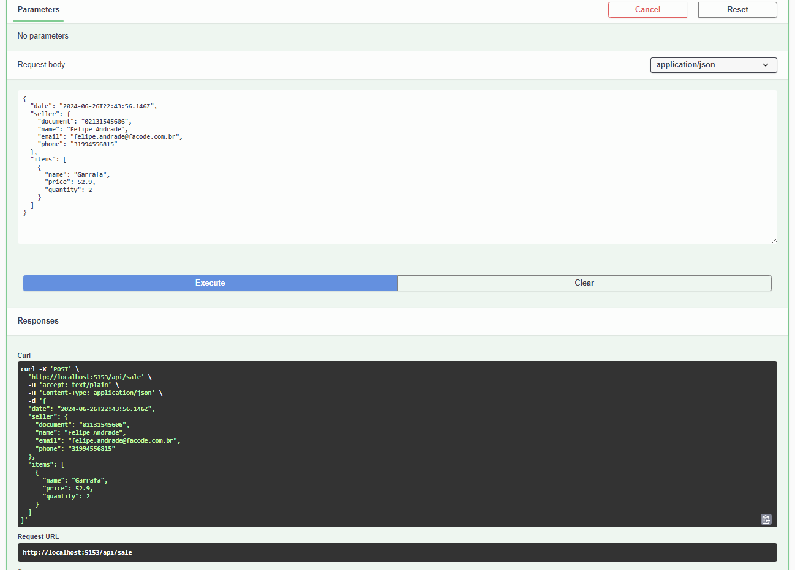
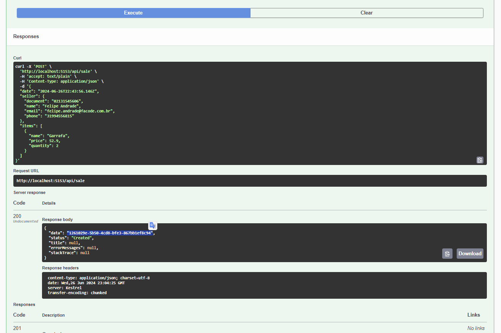
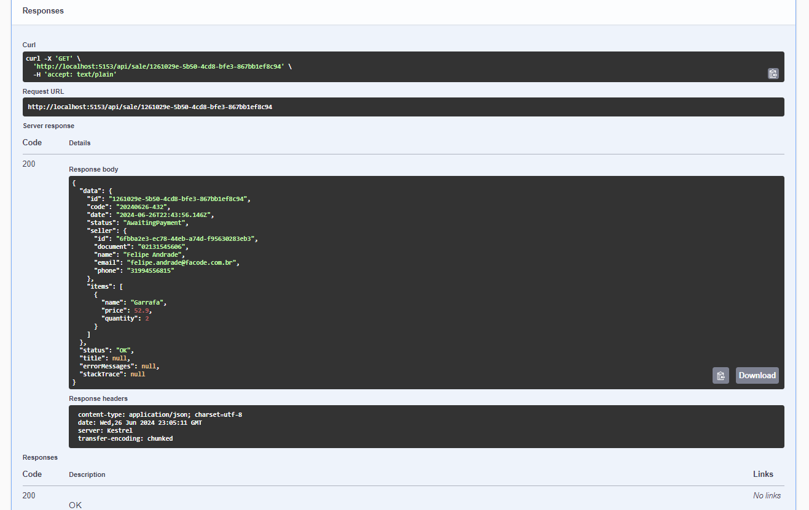
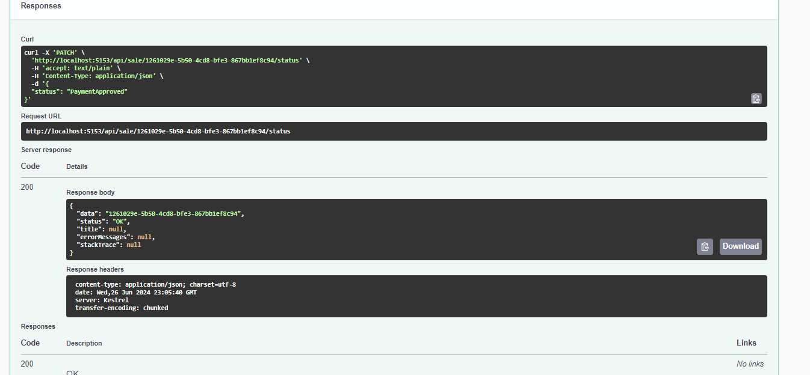
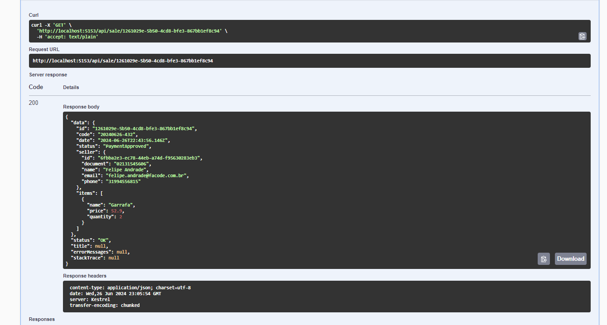
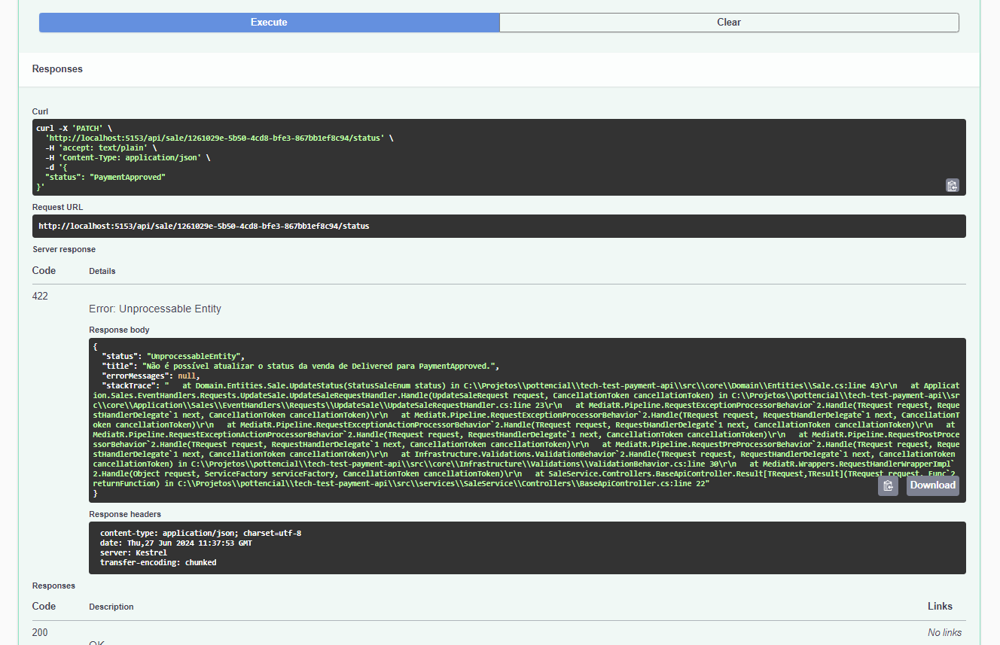

# RestApiTemplate - API
> API para gerenciar sales de produtos.

Todos os diagramas foram gerados pelo arquivo `sales-api-model.dsl` e compilados na plataforma https://structurizr.com/dsl

## Run project

```
Instalar as dependências/libs
dotnet restore ./src/services/ProductService/ProductService.csproj

Buildar o projeto
dotnet build ./src/services/ProductService/ProductService.csproj

Rodar o projeto
dotnet run --project ./src/services/ProductService/ProductService.csproj
```

## Diagrama de container

![[Container] Sistema de Products API](docs/assets/img/container-api.png)

## Diagrama de componentes

![[Componentes] Sistema de Products API - API REST](docs/assets/img/restapi-component.png)

## Diagrama de relacionamento

### Definição das entidades
![[DER] Diagrama de entidade e relacionamento](docs/assets/img/class-diagram.png)

![[Componentes] Diagrama de entidade e relacionamento](docs/assets/img/relacionamento-component.png)

## Testes unitários e de integração

O resultado do coverage pode ser acessado em `docs/coverage.json` ou `docs/coverage.html`

![[Coverage] Resultado do coverage do código](docs/assets/img/coverage.png)

## CI/CD

O deploy está configurado para ser orquestrado via github e serverless, sendo criada uma lambda (AWS) para acesso ao conteúdo da API

Para acesso a API e sua documentação [clique aqui](https://2s7w8wyei6.execute-api.us-east-1.amazonaws.com/dev/swagger/index.html)

## Evidências
API rodando


Inserindo uma venda



Obtendo uma venda


Atualizando uma venda



Atualizando uma venda para um status fora da regra de negócio


## Sugestões de melhorias

Considerando a usabilidade do usuário/sistema seria interessante incluir endpoints de busca em lote, podento filtrar por vendedor e data.

O ideal é termos um cadastro separado para os vendedores, sabendo que o mesmo poderá realizar mais de uma venda. Considerando que a API seja para realizar uma integração entre sistemas, podemos considerar que os dados sempre serão enviados corretamente.

Utilizei a estrutura de objetos para salvar em um arquivo .json, pois, por ser uma API que atende a um caso específico (Gestão de vendas), minha sugestão seria mantermos os dados em um banco de dados não relacional (NoSQL). Com isso, teríamos que ter o cuidado em atualizações dos dados do vendedor.

Como incluí o deploy na AWS Lambda, onde o `Runtime` da AWS Lambda permite somente `dotnet6`, o projeto foi desenvolvido usando o `SDK 6.0` do .NET. Uma futura melhoria seria modificar o ambiente para `K8S`, onde, em uma eventual escala em microserviços, facilitaria a gestão de recursos. 